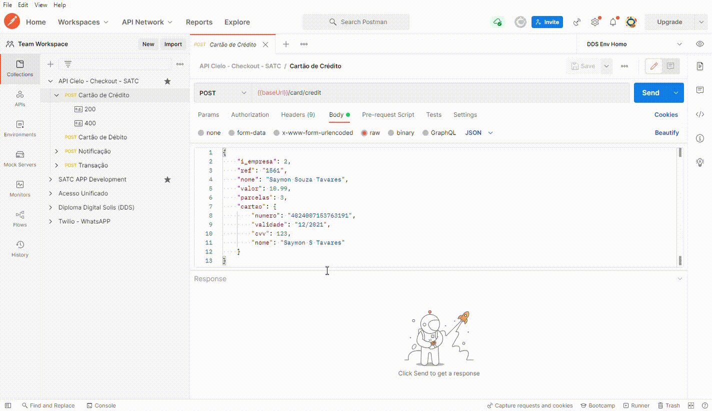

# api-cielo
[](https://opensource.org/licenses/MIT)
[](https://www.npmjs.com/package/react)

Fornece uma API que permite ao lojista Cielo realizar pagamento simplificado e modular, a consulta bin/bandeira é feita automaticamente no pagamento.

### Índices

- [Overview](#overview)
- [Built](#built-with)
- [How To Use](#how-to-use)
- [Contact](#contact)

### Overview


### Built With
- [ReactJS](https://reactjs.org/)
- [ViteJS](https://vitejs.dev/)

### How To Use
To clone and run this application, you'll need Git and Node.js (which comes with npm) installed on your computer. From your command line:
```bash
# Clone this repository
$ git clone https://github.com/saymontavares/react-calculator.git
```
```bash
# Install dependencies
$ npm i
```
```bash
# Run the app
$ npm run dev
```

## Contact

- GitHub [@saymontavares](https://github.com/saymontavares)

Thank You! developed by **Saymon Tavares**.
